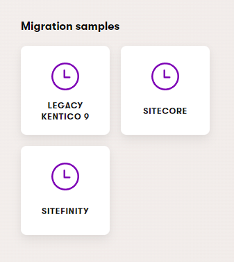
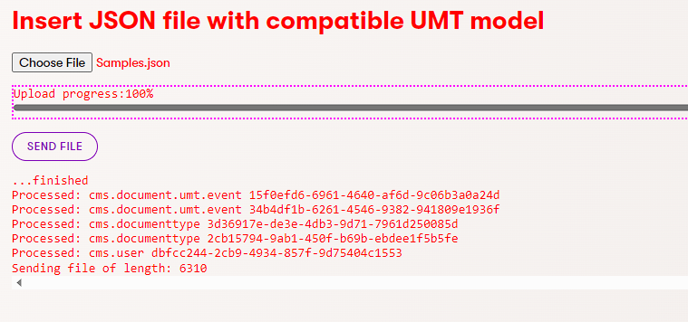

# Admin sample

1. Install the NuGet package

   ```powershell
   dotnet add package <Package Name> --version 1.2.3
   ```
2. run instance and navigate to on of sample applications  
   
3. prepare sample data, edit [here](./Data/Samples.json)  
   1. change `"NodeParentGuid": "acdd2058-bde0-4c9d-8332-45f417220571",` to NodeGuid of root node in Your site  
4. choose file (sampli file is [here](./Data/Samples.json))  
   
5. click "Send file"
6. expected result  
   

7. in administration imported entities should appear in sections **Users**, **Content Hub**, **Content types**
