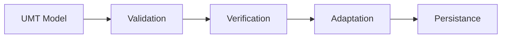
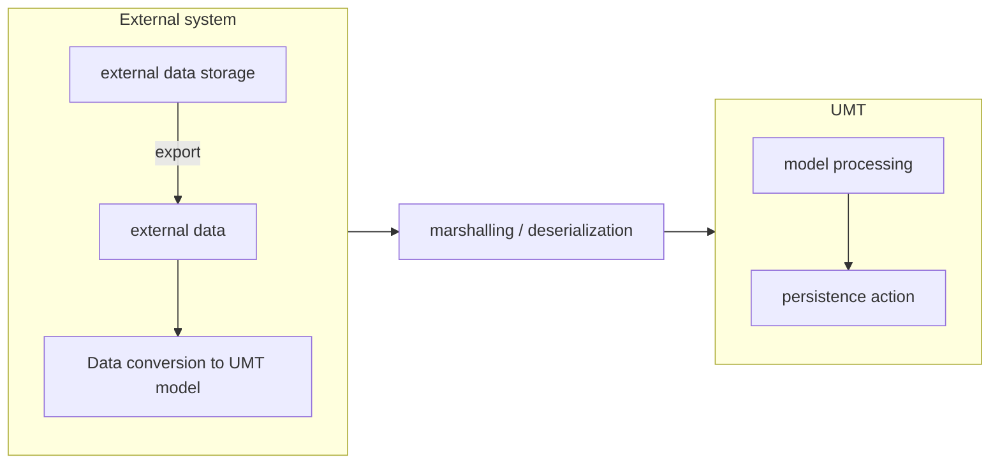

# UMT Guides

## 🚀 Installation

1. install nuget package
2. Open file with dependency injection container configuration (`Program.cs` / `Startup.cs` / ...)
3. import namespace `Kentico.Xperience.UMT`
4. register Umt to service collection `IServiceCollection` using `AddUniversalMigrationToolkit()`
5. inject `IImportService` where you want use migration toolkit

Installation and usage samples:

- [Console application](../Examples/Kentico.Xperience.UMT.Example.Console/)
- [Administration plugin](../Examples/Kentico.Xperience.UMT.Example.AdminApp/)

## Usage

1. inject [IImportService](Class/IImportService.md) as `importService`
2. create new instace of [ImportStateObserver](Class/ImportStateObserver.md)
3. bind events on [ImportStateObserver](Class/ImportStateObserver.md)
   - [Imported info](Class/ImportStateObserver.md#importedinfo) tracking successful objects
   - [Validation error](Class/ImportStateObserver.md#validationerror) UMT model with incorrect format
   - [Exception](Class/ImportStateObserver.md#exception) when import of single model fails from eny reason
4. call [StartImportAsync](Class/IImportService.md#startimportasync) to start import
   1. (optional) deserialize from json stream using [FromJsonStream](Class/IImportService.md#fromjsonstream)
5. await [importObserver.ImportCompletedTask](Class/ImportStateObserver.md#importcompletedtask)

## Model creation & design

Following concepts are subject to this guide:

- Overview of UMT and concepts behind
- [DataClass](./Model/DataClassModel.md) creation
- [ContentItem](./Model/ContentItemModel.md) creation
- Designing storage in database
- Designing view of edited page inside administration

Main purpose of UMT is to upsert modeled data to target XbyK database through Kentico API.

### What UMT does



#### Validation

model is validated if contained data are in correct format where applicable.

#### Verification

some data are subject to CMS domain constraints, verification phase will ensure that no domain rules are broken.

#### Adaptation

transformation of serializable structure to XbyK Info objects and connection of object refrences

#### Persistnce

using appropriate XbyK InfoProvider UMT performs insert/update to target XbyK instance

### Process overview



### Data export

multiple strategies are recommended:

- export raw data and convert them later
- perform conversion to UMT model while exporting data

Supported serialization formats by UMT:

- JSON
- XML (in future)

Exported data are constrained by [supported property types by XbyK](./Enums/ColumnType.md)

### Data class modeling

Lets discuss following example:

```json
{
  "$type": "DataClass",
  "ClassDisplayName": "Event",
  "ClassName": "UMT.Event",
  "ClassIsDocumentType": true,
  "ClassIsCoupledClass": true,
  "ClassNodeNameSource": "EventTitle",
  "ClassTableName": "UMT_Event",
  "ClassShowAsSystemTable": false,
  "ClassNodeAliasSource": "EventTitle",
  "ClassGUID": "3d36917e-de3e-4db3-9d71-7961d250085d",
  "ClassIsForm": false,
  "ClassUsesPageBuilder": true,
  "ClassHasURL": true,
  "ClassHasMetadata": true,
  "ClassIsPage": true,
  "ClassHasUnmanagedDbSchema": false,
  "ClassPrimaryKeyName": "EventID",
  "Fields": []
}
```

Example creates model for [Content type](https://docs.xperience.io/xp/developers-and-admins/development/content-types) which is subset of [Object type](https://docs.xperience.io/xp/developers-and-admins/customization/object-types) represented by structure `CMS.DataEngine.DataClassInfo`.
This enables creation [Content item](./References.md#content_item) of class `UMT.Event`.

Properties set in this example:

- `$type` - <sup>important</sup>first we need to set [discriminator](./UmtModel.md#discriminator) by which UMT will know `DataClassModel` model. Next fill properties according to [DataClassModel docs](./Model/DataClassModel.md).
- `ClassDisplayName` - this value is displayed in administration, administrators/editors will see it
- `ClassName` - [CodeName](./References.md#code_name) of object
- `ClassIsDocumentType` - class will hold data for [Page](./References.md#page) (in tree structure)
- `ClassIsCoupledClass` - class can contain custom data (this can be false in cases where we don't need to any custom data - NavigationItem, ...)
- `ClassTableName` - in SQL database of target instance, sql table `dbo.UMT_Event` will hold our custom article data
- `ClassShowAsSystemTable` - marks class as internal, this will be always false for newly created dataclasses
- `ClassGUID` - [Unique ID](./UmtModel.md#uniqueid) by which we will reference this one particular class for purposes of UMT
- `ClassIsForm` - defines that dataclass represents form, for [Content type](https://docs.xperience.io/xp/developers-and-admins/development/content-types) always `false`
- `ClassIsPage` - only if [Content type](https://docs.xperience.io/xp/developers-and-admins/development/content-types) will also be a [Page](./References.md#page)
- `ClassPrimaryKeyName` - SQL Table autoseeded interger primary key name, recommended convention `[Class name without namespace]ID`, in this instance `EventID`
- `Fields` - contains information about fields used in class, they will mostly have database representation
  - for field you define how database column is created, how field is viewed in XbyK administration

lets add field by creating object in `Fields` array ([more](./Model/DataClassModel.md#formfield) about modeling field):

```json
"Fields": [
  {
    "AllowEmpty": false,
    "Column": "EventTitle",
    "ColumnSize": 200,
    "ColumnType": "text",
    "Enabled": true,
    "Guid": "0e1e63eb-918a-4135-a627-04393672d6f4",
    "Visible": true,
    "Properties": {
      "FieldCaption": "Title"
    },
    "Settings": {
      "ControlName": "Kentico.Administration.TextInput"
    }
  }
]

```
